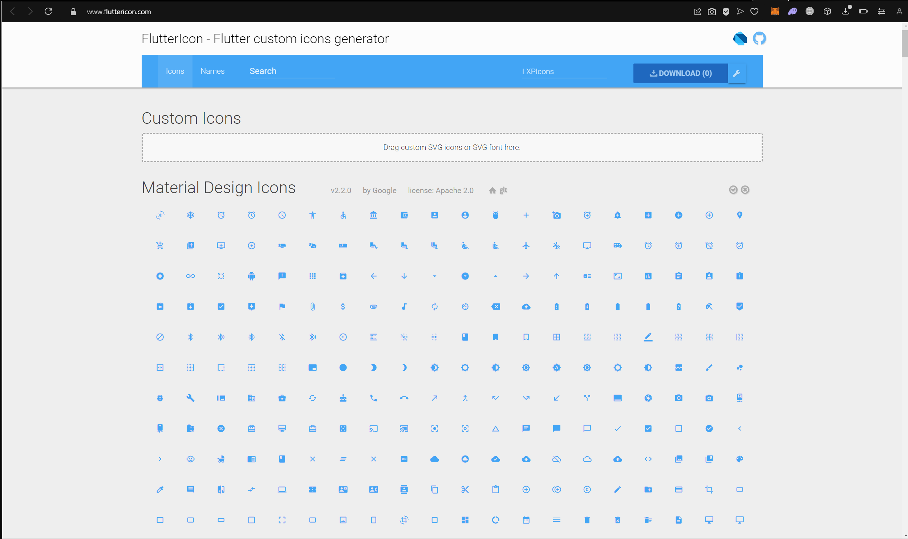
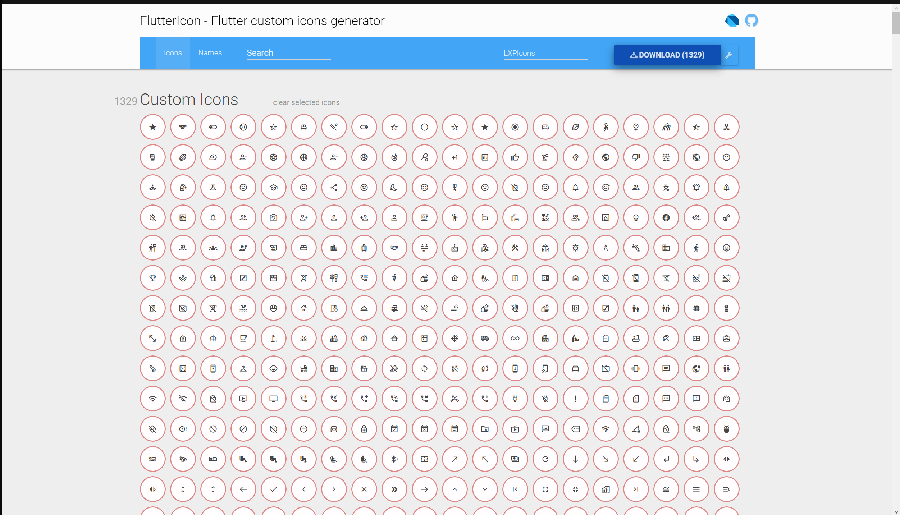
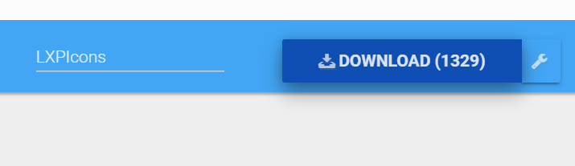

Как создать собственный шрифт с кастомными иконками

1 Шаг
Для этого можно использовать данный сайт - https://www.fluttericon.com

2 Шаг 

На сайте вас будет ждать вот такой интерфейс где есть раздел Custom Icons с полем куда нужно перетащить все наши SVG иконки из какой либо папки.

3 Шаг

После того как мы перетащили все необходимые иконки, нам нужно выделить все иконки, которые мы хоти видеть в нашем шрифте. Это можно сделать просто проводя по всему полю иконок зажатый курсор. 

4 Шаг

Даем какое либо название нашему шрифту и нажимаем на кнопку Download

Далее у вас скачается архив с файлом шрифта и дарт файл с готовыми переменными иконок для вашего Flutter проекта.

